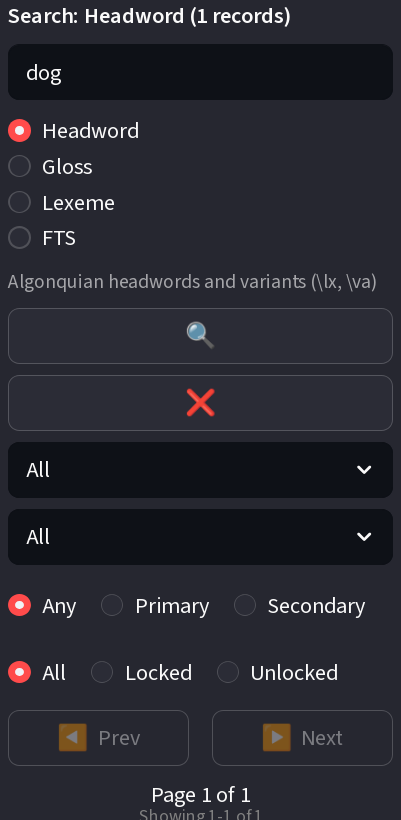

# Spec: Records View Left Panel Filter UX Improvements

---

## Intent and Executive Summary

| Field | Content |
|-------|---------|
| Problem Statement | The Records view left panel filter controls confuse users. Dropdown labels say "All" without explaining scope. Language filters stay enabled in FTS mode even though they do not apply, misleading users. Search and clear buttons stack vertically, wasting space. The clear button does not visually clear the search input until the next interaction. |
| Root Cause / Motivation | Streamlit defaults produce ambiguous labels. The current code does not tie filter enabled state to search mode. Buttons use `use_container_width=True` without a shared layout container. The clear handler updates session state but omits `st.rerun()`. |
| Approach Chosen | Rename dropdown defaults to explicit labels. Add mode-driven disabled state for language filters. Replace vertical button stack with a two-column side-by-side layout. Add `st.rerun()` to the clear handler. |
| Alternatives Considered & Why Discarded | Hiding filters in FTS mode instead of disabling them — discarded because hiding removes context and confuses users about where the controls went. Using a single combined search/clear button — discarded because it conflates two distinct actions. |
| Key Design Decisions | Keep existing session state keys and rename display labels only, to preserve saved preferences. Disable rather than hide filters in FTS mode, with tooltip explanation. Use `st.columns(2)` for equal-width button distribution. |

---

## Objective

Improve the user experience of the left panel filter controls in the Records view by making filter labels clearer and disabling inapplicable filters based on search mode.

---

## Constraints

| Constraint Type | Details |
|-----------------|---------|
| **Technical** | MUST NOT break existing filter functionality for Lexeme mode searches |
| **UX** | Changes MUST improve clarity without breaking muscle memory |
| **Testing** | Existing tests MUST continue to pass; new tests MAY be added for FTS + filter behavior |
| **Dependency** | Spec #400 MUST be implemented first |

---

## Affected Files

| File | Anchor | Description |
|------|--------|-------------|
| `src/frontend/pages/records.py` | `"Select Source"` selectbox (line ~177) | Sources dropdown with "All" option |
| `src/frontend/pages/records.py` | `"Select Language"` selectbox (line ~183) | Languages dropdown with "All" option |
| `src/frontend/pages/records.py` | `"Language Role"` radio (line ~189) | Language role filter radio buttons |
| `src/frontend/pages/records.py` | Sidebar filter section | Filter disable logic based on search mode |
| `src/frontend/pages/records.py` | Search/clear buttons (lines ~214-219) | Button layout and clear behavior |
| `src/services/linguistic_service.py` | `search_records()` method | Backend search logic with language filters |
| `tests/ui/mocks/records.py` | Mock filter controls | Test mock for UI filters |

---

## Success Criteria

| ID | Criterion | Verification Method | Remediation | Pipeline Step Binding | Artifact Path | Requirement Traceability | Phase Binding | Verification Gate | Integration Mode | Affinity Group | Re-Entry Step | Test File | Phase Mapping |
|----|-----------|-------------------|-------------|----------------------|--------------|-------------------------|--------------|-----------------|----------------|--------------|-------------|-----------|--------------|
| SC-1 | Sources dropdown default label shows "All Sources" instead of "All" | Render records page, inspect sources dropdown default option | Fix label string and session state init if incorrect | Phase 1 | `.issues/401/` | Req: Ambiguous Filter Labels | Phase 1 | red-green | - | Filter Labels | Phase 1 | test_records_filter_labels.py | Phase 1 |
| SC-2 | Languages dropdown default label shows "All Languages" instead of "All" | Render records page, inspect languages dropdown default option | Fix label string and session state init if incorrect | Phase 1 | `.issues/401/` | Req: Ambiguous Language Filter Label | Phase 1 | red-green | - | Filter Labels | Phase 1 | test_records_filter_labels.py | Phase 1 |
| SC-3 | Language role filter behavior is clarified/adjusted | Execute search with each language role option, verify expected results | Investigate and fix language role behavior in `search_records()` | Phase 1 | `.issues/401/` | Req: Language Role Filter Behavior | Phase 1 | red-green | - | Filter Behavior | Phase 1 | test_records_language_role.py | Phase 1 |
| SC-4 | Language and Language Role filters are disabled when search mode is FTS | Select FTS mode, verify Language dropdown and Language Role radio are disabled | Add mode detection and `disabled` parameter in sidebar render | Phase 2 | `.issues/401/` | Req: Inapplicable Filters in FTS | Phase 2 | pre-commit | - | FTS UX | Phase 2 | test_records_fts_disable.py | Phase 2 |
| SC-5 | Existing Lexeme mode searches continue to work with language filters | Execute Lexeme mode search with language filters, verify results are filtered | Ensure mode detection does not affect Lexeme mode enable logic | Phase 2 | `.issues/401/` | Req: Maintain Existing Behavior | Phase 2 | pre-commit | - | Regression | Phase 2 | test_records_lexeme_regression.py | Phase 2 |
| SC-6 | Clear visual indication when filters are disabled (grayed out, tooltip explanation) | Select FTS mode, verify disabled filters appear grayed out with tooltip | Add Streamlit tooltips to disabled filter widgets | Phase 2 | `.issues/401/` | Req: User Clarity in FTS | Phase 2 | pre-commit | - | FTS UX | Phase 2 | test_records_fts_tooltips.py | Phase 2 |
| SC-7 | Headword and Gloss modes (from #400) work with language filters enabled | Select Headword/Gloss mode, verify Language and Language Role filters are enabled | Add enable-logic for Headword/Gloss modes after #400 merge | Phase 4 | `.issues/401/` | Req: New Search Mode Support | Phase 4 | pre-commit | - | Mode Support | Phase 4 | test_records_headword_gloss.py | Phase 4 |
| SC-8 | Empty search input returns all records / no error | Submit empty search, verify all records returned without error | Fix search query handling for empty strings | Phase 3 | `.issues/401/` | Req: Search Input Robustness | Phase 3 | pre-commit | - | Search Controls | Phase 3 | test_records_empty_search.py | Phase 3 |
| SC-9 | Unicode characters in filter values don't crash | Enter Unicode filter values (e.g., accented chars, CJK), verify no crash | Ensure UTF-8 handling in filter serialization | Phase 3 | `.issues/401/` | Req: Unicode Safety | Phase 3 | ci | - | Search Controls | Phase 3 | test_records_unicode.py | Phase 3 |
| SC-10 | Active filter state persists across mode switches | Set filter, switch modes, switch back, verify filter values preserved | Verify session state preservation logic; add explicit preservation if needed | Phase 3 | `.issues/401/` | Req: Session State Integrity | Phase 3 | pre-commit | - | Search Controls | Phase 3 | test_records_state_persistence.py | Phase 3 |
| SC-11 | Search (🔍) and Clear (❌) buttons render on the same horizontal line | Render records page, verify buttons are side-by-side | Replace vertical button blocks with `st.columns(2)` layout | Phase 3 | `.issues/401/` | Req: Button Layout | Phase 3 | red-green | - | Search Controls | Phase 3 | test_records_button_layout.py | Phase 3 |
| SC-12 | Clear search button immediately empties input box and refreshes results | Enter text, click clear, verify input is empty and full record list is shown | Add `st.rerun()` to clear handler | Phase 3 | `.issues/401/` | Req: Clear Button Behavior | Phase 3 | red-green | - | Search Controls | Phase 3 | test_records_clear_behavior.py | Phase 3 |

---

## Edge Cases

1. **User switches from FTS to Lexeme/Headword/Gloss**: Filters MUST re-enable with previous values preserved.
2. **User has language filter selected then switches to FTS**: Selected filter MUST be visually disabled but not cleared.
3. **URL query parameters**: If search mode is passed via URL, filters MUST respect the mode on load.
4. **New search modes from #400**: Headword and Gloss modes MUST have language filters enabled.

---

## Risk Assessment

| RISK-ID | Risk Description | Likelihood | Impact | Mitigation | Verifying SC |
|---------|-----------------|------------|--------|------------|--------------|
| RISK-1 | Breaking existing filter behavior for Lexeme mode | Low | Medium | Test both Lexeme and FTS modes thoroughly | SC-5 |
| RISK-2 | User confusion about disabled filters in FTS mode | Medium | Low | Add tooltips explaining why filters are disabled | SC-6 |
| RISK-3 | Session state bugs when switching modes | Low | Low | Verify session state preservation logic | SC-10 |
| RISK-4 | Dependency on Spec #400 not implemented first | High | High | Implement #400 first, then this spec | SC-7 |

---

## Decision Ledger

| DEC-ID | Decision | Rationale | Requirement Key | Affected SCs |
|--------|----------|-----------|-----------------|--------------|
| DEC-1 | Keep existing session state keys | Preserve saved user preferences across deployments | MUST | SC-1, SC-2 |
| DEC-2 | Disable rather than hide filters in FTS mode | Maintain user context and avoid confusion about missing controls | MUST | SC-4, SC-6 |
| DEC-3 | Use `st.columns(2)` for equal-width buttons | Let Streamlit handle width distribution automatically | SHOULD | SC-11 |
| DEC-4 | Add `st.rerun()` to clear handler | Immediate visual feedback is critical for perceived responsiveness | MUST | SC-12 |

---

## Phase 1: Filter Label Updates

**Concern:** User Clarity  
**Interdependencies:** NONE (independent of #400)

### Steps
1. Update sources filter dropdown label from "All" to "All Sources"
2. Update languages filter dropdown label from "All" to "All Languages"
3. Update default name mapping in session state initialization
4. Investigate and document language role filter behavior; adjust if needed

### Content

**TDD Cycle:**
- **Steps 1-2 RED:** Write test asserting sources dropdown default is "All Sources" and languages dropdown default is "All Languages". GREEN: Update dropdown default label strings in `records.py` and session state init. REFACTOR: Extract label strings to named constants if inline literals remain.
- **Step 3 RED:** Write test asserting session state initializes with "All Sources" / "All Languages" keys. GREEN: Update session state initialization to use new default names. REFACTOR: Verify no other code references old "All" default.
- **Step 4 RED:** Write test asserting language role filter returns expected results for each option. GREEN: Investigate and document language role filter behavior; adjust if needed. REFACTOR: Clean up investigation artifacts.

---

## Phase 2: FTS Filter Disabling

**Concern:** Search Mode UX  
**Interdependencies:** Spec #400 (needs Headword and Gloss modes to exist for correct mode detection)

### Steps
1. Add search mode detection in sidebar render to identify FTS mode (vs Lexeme, Headword, Gloss)
2. Disable Language dropdown when search mode is FTS (using Streamlit's `disabled` parameter)
3. Disable Language Role radio when search mode is FTS
4. Add tooltips explaining why filters are disabled in FTS mode
5. Verify session state preserves filter values when disabled

### Content

**TDD Cycle:**
- **Step 1 RED:** Write test asserting search mode detection correctly identifies FTS vs Lexeme/Headword/Gloss. GREEN: Add search mode detection logic in sidebar render. REFACTOR: Extract mode detection to a helper function if inline logic grows.
- **Steps 2-3 RED:** Write test asserting Language dropdown and Language Role radio are disabled when mode is FTS. GREEN: Add `disabled` parameter to Language dropdown and Language Role radio based on mode detection. REFACTOR: Verify disabled state reads from single mode variable, not duplicated checks.
- **Step 4 RED:** Write test asserting tooltip text is present when filters are disabled in FTS mode. GREEN: Add Streamlit tooltips to disabled filter widgets. REFACTOR: Verify tooltip wording is consistent across disabled widgets.
- **Step 5 RED:** Write test asserting filter values preserved in session state when switching to/from FTS mode. GREEN: Verify session state preservation logic; add explicit preservation if needed. REFACTOR: Consolidate session state preservation into single function.

---

## Phase 3: Search Control Layout and Clear Behavior

**Concern:** Search Input UX  
**Interdependencies:** NONE (independent of #400)

### Steps
1. Wrap search (🔍) and clear (❌) buttons in a single Streamlit `st.columns(2)` layout so they render side-by-side
2. Remove `use_container_width=True` from both buttons; use `use_container_width=True` inside each column instead
3. Add `st.rerun()` after `st.session_state.search_query = ""` in the clear button handler so the input box empties immediately
4. Verify clear action also resets `current_page = 1` and any active filter state tied to the search query

### Content

**TDD Cycle:**
- **Steps 1-2 RED:** Write test asserting search and clear buttons are horizontally aligned with equal width. GREEN: Replace vertical button blocks with `st.columns(2)` layout. REFACTOR: Extract button layout to a helper if reused elsewhere.
- **Step 3 RED:** Write test asserting input box text is empty immediately after clicking clear. GREEN: Add `st.rerun()` to clear handler. REFACTOR: Ensure rerun is guarded against infinite loops.
- **Step 4 RED:** Write test asserting page resets to 1 after clear. GREEN: Verify `current_page` reset in clear handler. REFACTOR: Consolidate reset logic into single function.

---

## Phase 4: New Search Mode Filter Behavior

**Concern:** Headword/Gloss Support  
**Interdependencies:** Spec #400 (new search modes must exist)

### Steps
1. Verify Headword mode (from #400) has language filters ENABLED
2. Verify Gloss mode (from #400) has language filters ENABLED
3. Test language role filter with Headword and Gloss modes
4. Add tests for all four search modes with language filters

### Content

**TDD Cycle:**
- **Steps 1-2 RED:** Write test asserting Headword and Gloss modes have Language and Language Role filters enabled. GREEN: Add enable-logic for Headword/Gloss modes (may already work if mode detection is correct). REFACTOR: Verify enable/disable logic is table-driven, not if-else chain.
- **Step 3 RED:** Write test asserting language role filter returns correct results for Headword and Gloss modes. GREEN: Verify or fix language role filter behavior with new modes. REFACTOR: Merge test cases with Phase 1 language role tests if overlapping.
- **Step 4 RED:** Write test asserting comprehensive test matrix covering all 4 modes × language filter states. GREEN: Add remaining test coverage for mode/filter combinations. REFACTOR: Consolidate test fixtures for multi-mode testing.

---

## Phase 5: Behavior Investigation

**Concern:** Backend Correctness  
**Interdependencies:** NONE (independent of frontend changes)

### Steps
1. Confirm whether language filters apply correctly in FTS mode (headword+va search)
2. If filters don't apply: document behavior and proceed with disabled state
3. If filters should apply: fix backend search logic to respect language filters in FTS mode
4. Add test coverage for FTS mode with language filters

### Content

**TDD Cycle:**
- **Step 1 RED:** Write test asserting FTS search with language filter returns linguistically filtered results (or documents that filters don't apply). GREEN: Investigate FTS backend behavior with language filters applied. REFACTOR: Clean up investigation test artifacts if they are throwaway.
- **Steps 2-3 RED:** Write test asserting if filters should apply, FTS search respects language filter; if not, FTS search ignores filter correctly. GREEN: Fix backend or document behavior based on investigation. REFACTOR: Ensure backend and frontend filter-disable logic are consistent.
- **Step 4 RED:** Write test asserting FTS mode with language filters end-to-end test. GREEN: Add integration test for FTS + language filter combination. REFACTOR: Merge with Phase 2 FTS disable tests for coherent coverage.

---

## Explicit Non-Goals

- **Backend search algorithm changes** — Out of scope unless investigation reveals actual bugs in `search_records()`.
- **New search mode creation** — Headword and Gloss modes are handled by Spec #400.
- **Internationalization of labels** — English labels only for this release.

---

## Regression Invariants

1. Existing Lexeme mode authentication flows MUST continue to work with current filter values.
2. All existing public API signatures in `linguistic_service.py` MUST remain unchanged.
3. Database schema for filter storage MUST NOT be modified.

---

## Documentation Sources

| Source Category | What Was Consulted | Purpose |
|-----------------|-------------------|---------|
| Direct source search | `src/frontend/pages/records.py` | Understand current filter control implementation |
| Direct source search | `src/services/linguistic_service.py` | Verify search backend and filter application |
| MCP search | `srclight_get_signature("search_records")` | Verify function signature and parameters |
| Live verification | `uv run pytest test/ui/mocks/records.py` | Confirm existing test coverage |

---

## Pre-state UI Reference

Permanent local reference image: `pre-state-ui.png`

---

🤖 Co-authored with AI: OpenCode (ollama-cloud/kimi-k2.7-code)